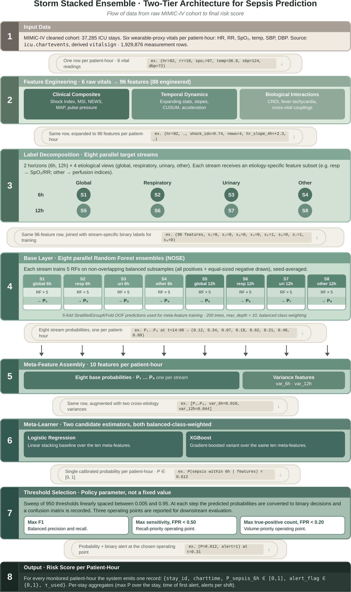
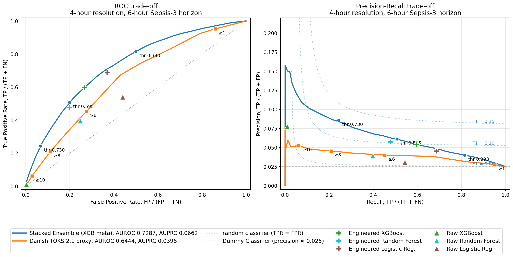
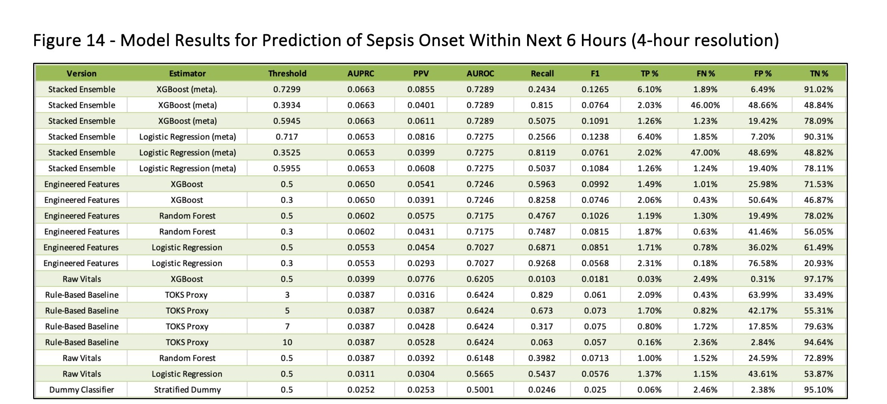
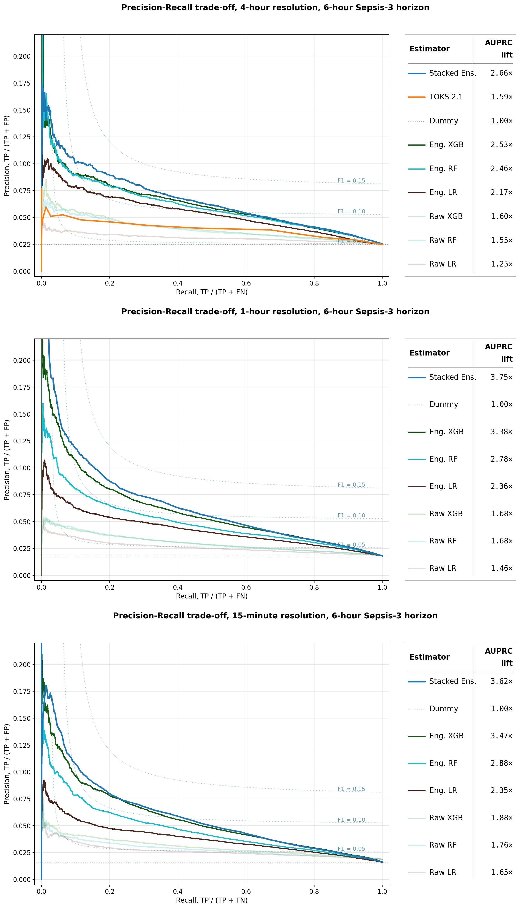
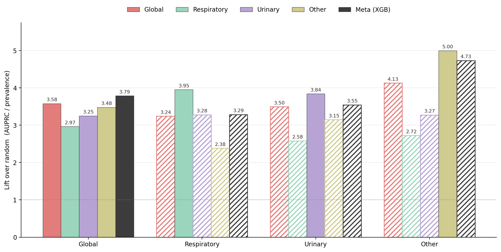
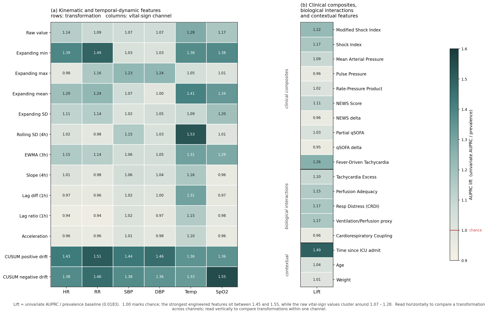

# Sepsis Prediction from Wearable-Grade Vital Signs

Reproducibility code for the BSc thesis **"Leveraging Machine Learning and
Wearables Technology for Sepsis Prediction and Workflow Optimization"**
by **Nikolaj Storm Petersen** (Copenhagen Business School, 2026).

[-b31b1b.svg)](paper/Storm_Petersen_2026_Sepsis_Wearables_Thesis.pdf)
[](LICENSE)
[-orange.svg)](DATA_ACCESS.md)

> 📄 **Read the paper.** The full bachelor thesis this code accompanies is in
> [`paper/Storm_Petersen_2026_Sepsis_Wearables_Thesis.pdf`](paper/Storm_Petersen_2026_Sepsis_Wearables_Thesis.pdf),
> with a 2-page [English summary](paper/Storm_Petersen_2026_English_Summary.pdf).
> Start there for the full argument, methods, and results; this repository holds
> the code behind it.

> **License in one line.** Free to use and adapt for **non-commercial** purposes
> **with attribution**. Commercial use is not permitted. See [How to cite](#license--how-to-cite).

---

## Some results

A few headline figures from the thesis. See the
[full paper](paper/Storm_Petersen_2026_Sepsis_Wearables_Thesis.pdf) for complete
captions, methods, and the rest of the analysis.

**The pipeline at a glance** — from six raw wearable-proxy vitals to a
per-patient-hour sepsis risk score, via etiology-specialized base learners and a
stacked meta-learner.



**Headline performance (Figure 16).** The stacked ensemble (blue) versus a Danish
TOKS 2.1 clinical-practice proxy (orange) at 4-hour sampling. AUROC 0.7287 vs
0.6444 and AUPRC 0.0662 vs 0.0396, a 67% lift in sepsis-specific discrimination
over current practice.



**All estimators, 6-hour horizon (Figure 14).** Every model at 4-hour resolution,
from the stacked ensemble down to single-model baselines, raw vitals, and the
rule-based TOKS proxy.



**More frequent sampling helps (Figure 20).** AUPRC lift over chance rises from
2.66x at 4-hour sampling to 3.75x at 1-hour, the advantage of wearable-frequency
monitoring over current ward practice.



**Etiology specialization works (Figure 18).** Each infection-specific base learner
predicts its own etiology best (diagonal dominance), and the stacked meta-learner
beats the global model across streams.



**What the model leans on (Figure 17).** Univariate AUPRC lift per engineered
feature. CUSUM drift, expanding statistics, and temperature dynamics carry the
most standalone signal.



---

## What this is

The thesis asks whether the six vital signs a wearable can capture (heart rate,
respiratory rate, SpO2, temperature, systolic and diastolic blood pressure) are
enough to predict **Sepsis-3** onset on hospital wards earlier than current
practice, and under what organizational conditions such a system would be viable.

The technical contribution is an **etiology-specific stacked ensemble**:
base-learners specialised by infection source (respiratory, urinary, other),
combined by a meta-learner, trained under a class-imbalance scheme on MIMIC-IV.
Headline result, measured as AUPRC lift over chance at 4-hour sampling: **+67%**
sepsis-specific discrimination over a Danish TOKS 2.1 clinical-practice proxy,
with a further **+41%** at wearable sampling frequency.

This repository holds **every script behind the paper**, each one white-labeled
and self-documenting (see below), so the work can be inspected and replicated.

> **Data notice.** The study uses MIMIC-IV, which is credentialed-access under
> the PhysioNet Data Use Agreement. **No patient data, processed dataset, or
> trained model is included here, only code.** A small synthetic sample is
> provided so the pipeline can be run end-to-end without real data. See
> [`DATA_ACCESS.md`](DATA_ACCESS.md).

---

## Every script is white-labeled and self-documenting

Each script has, over a plain copy:

1. A **documentation header** at the top with its purpose, the files it reads
   and writes, and a `USER-EDITABLE SETTINGS` list of everything you are likely
   to change (paths, credentials, sampling resolution, every hyperparameter).
2. Inline **`EDIT:` tags** (669 across the 66 scripts) marking each placeholder
   and tunable value, plus a one-line **attribution banner**.

```bash
grep -rn "EDIT:" .            # every editable spot across all scripts
grep -n  "EDIT:" run_toks21_proxy.py   # ...in one script
```

### Placeholder tokens (replace with your own before running)

| Token | Replace with |
|---|---|
| `/PATH/TO/PROJECT` | Absolute path to your local project/data root |
| `/PATH/TO/OUTPUT` | Directory for figures/exports |
| `/PATH/TO/INPUT` | Directory holding an input you supply |
| `YOUR_GCP_PROJECT` | Your Google Cloud project id (BigQuery, Stage 1) |
| `YOUR_DERIVED_DATASET` | Your BigQuery dataset with the `mimic-code` derived tables (sepsis3, suspicion_of_infection, sofa) |

Public `physionet-data.mimiciv_3_1_*` references are left as-is.

---

## Quickstart (no real data needed)

```bash
pip install -r requirements.txt
python tools/make_synthetic_data.py    # writes a tiny synthetic sample to data/synthetic/
python tools/demo_smoke_test.py        # confirms the data format + model code wire up
```

The smoke test prints `SMOKE TEST PASSED`. Its metrics are meaningless (random
data); it only confirms the plumbing runs on your machine. Reproducing the
paper's results needs real MIMIC-IV ([`DATA_ACCESS.md`](DATA_ACCESS.md)).

---

## Layout

```
.
├── README.md  ·  LICENSE  ·  CITATION.cff  ·  DATA_ACCESS.md  ·  requirements.txt
├── paper/                  the bachelor thesis (PDF) + 2-page English summary
├── assets/figures/         result figures shown in this README
├── data/synthetic/         synthetic sample (schema-faithful, fake values)
├── tools/                  make_synthetic_data.py, demo_smoke_test.py
├── <root scripts>.py       comparators (run_*) and figure scripts
└── technical/
    ├── Cleansing/          Stage 1-2: extraction (SQL + BigQuery), targets, etiology, cohort stats
    ├── Feature Engineering/ Stage 3: clinical composites, temporal, interaction features
    ├── Models/             Stage 4: baselines, V13, and the final V13b ensemble (V13/, V13b/)
    └── Visualizations/     Stage 6: figure scripts
```

The layout mirrors the original project, so each file maps one-to-one to the
script behind the paper. Numbered prefixes (`01_`, `50_`, `67_`, ...) follow the
pipeline order: extraction, feature engineering, modeling, evaluation.

Two broadly-applicable notes: several `technical/Models/` scripts use relative
paths (`../../Data`, `../../Results`) and assume their original working
directory (stated in each header); and a few figure scripts embed final metric
values as constants to reproduce the paper's figures exactly (each is listed
under `USER-EDITABLE SETTINGS` and tagged `EDIT:`).

---

## License & how to cite

Licensed under the **Creative Commons Attribution-NonCommercial 4.0
International License (CC BY-NC 4.0)**. You may share and adapt the code for
**non-commercial** purposes provided you **give credit**. Commercial use is not
permitted. Full terms in [`LICENSE`](LICENSE) and at
https://creativecommons.org/licenses/by-nc/4.0/.

If you use or build on this work, please cite (see [`CITATION.cff`](CITATION.cff)):

> Storm Petersen, N. (2026). *Leveraging Machine Learning and Wearables
> Technology for Sepsis Prediction and Workflow Optimization*. Copenhagen Business School. Licensed under CC BY-NC 4.0.

The license covers the **code only**. It grants no rights to MIMIC-IV, which is
governed by the PhysioNet Credentialed Health Data Use Agreement.
