# Sepsis Prediction Pipeline (V13b Master Technical Blueprint)

This visualization details the exhaustive step-by-step methodology of the final pipeline. The layout uses horizontal node grouping within vertical phase blocks, specifically mathematically proportioned to scale cleanly onto a standard A4 portrait page (with font sizes remaining robust and readable during export).

```mermaid
graph TB
    %% --------------------------------------------------
    %% PHASE 1: DATA INGESTION
    %% --------------------------------------------------
    subgraph P1 ["Phase 1: Raw Data Extraction & Temporal Alignment"]
        direction LR
        DB["Database Querying<br/>Relational SQL on MIMIC-IV.<br/>Extracted from chartevents,<br/>labevents, and admissions."]
        TIME["Temporal Discretization<br/>Uniform Pandas time-binning.<br/>Raw timestamps floored to 1-h<br/>windows, grouped by stay_id."]
        AGG["Base Aggregation<br/>Median/Mean statistical rules.<br/>Condenses high-frequency unit<br/>noise into stationary vectors."]
        
        DB --> TIME --> AGG
    end

    %% --------------------------------------------------
    %% PHASE 2: GROUND TRUTH
    %% --------------------------------------------------
    subgraph P2 ["Phase 2: Clinical Labeling & Ground Truth Formulation"]
        direction LR
        SOI["SOI Tracking<br/>Sequential 72h join mapping.<br/>Anchors Time-Zero via paired<br/>antibiotics + blood cultures."]
        S3["Severity Progression<br/>Binary target thresholding.<br/>Trailing 24h SOFA deltas ($\ge$ 2)<br/>& explicit ICD-9/10 algorithms."]
        TARG["Target Vectorization<br/>Multiclass-to-binary mapping.<br/>Preserves isolated signatures<br/>for Lung/Urinary etiologies."]
        
        SOI --> S3 --> TARG
    end

    %% --------------------------------------------------
    %% PHASE 3: ENGINEERING
    %% --------------------------------------------------
    subgraph P3 ["Phase 3: Preprocessing & Advanced Feature Engineering"]
        direction LR
        VARS["Raw Base Vectors<br/>Continuous extraction of<br/>HR, RR, SpO2, Temp, SBP, DBP<br/>+ Demographics (Age / Weight)."]
        IMP["Missingness Handling<br/>Point estimation via median.<br/>Resolves NaN sparsity natively<br/>to prevent algorithmic crash."]
        ENG["96-Feature Space<br/>Rolling variances, Derivatives<br/>(Velocity/Accel), 12h CUSUM,<br/>& Shock/Pulse interaction terms."]
        
        VARS --> IMP --> ENG
    end

    %% --------------------------------------------------
    %% PHASE 4: NOSE CORE
    %% --------------------------------------------------
    subgraph P4 ["Phase 4: The NOSE Architecture (Data Resampling & Core Training)"]
        direction LR
        NOSE["Geometric Resampling<br/>Non-Overlapping Subset slice.<br/>Splits the 95% Negative class<br/>into 5 strict, isolated chunks."]
        RF["Base Estimator Training<br/>Parallel Random Forest arrays.<br/>Fitted individually strictly<br/>to perfectly balanced 1:1 data."]
        
        NOSE --> RF
    end

    %% --------------------------------------------------
    %% PHASE 5: META-LEARNER
    %% --------------------------------------------------
    subgraph P5 ["Phase 5: Meta-Learning & Probability Calibration"]
        direction LR
        OOF["OOF Validation Matrix<br/>Stratified GroupKFold isolation.<br/>Yields an unbiased, 40-column<br/>multi-stream probability array."]
        LR["Logistic Regression<br/>Linear stacking aggregation.<br/>Clinically calibrates log-loss<br/>and smooths tree overconfidence."]
        
        OOF --> LR
    end

    %% --------------------------------------------------
    %% PHASE 6: OUTPUT
    %% --------------------------------------------------
    subgraph P6 ["Phase 6: Clinical Evaluation & Output"]
        direction LR
        OPT["Threshold Optimization<br/>Iterative ROC scan tracking.<br/>Maximizes Youden's J Statistic<br/>for optimal clinical boundary."]
        OUT["Final Performance Hub<br/>Evaluates Absolute TPR against<br/>safe False Positive constraints<br/>for final scientific benchmarking."]
        
        OPT --> OUT
    end

    %% --------------------------------------------------
    %% GLOBAL ROUTING
    %% --------------------------------------------------
    AGG --> SOI
    TARG --> VARS
    ENG --> NOSE
    RF --> OOF
    LR --> OPT

    %% --------------------------------------------------
    %% AESTHETIC STYLING (Blue -> Orange -> Purple Gradient)
    %% --------------------------------------------------
    style DB fill:#f0f0f0,color:#000,stroke:#666
    style TIME fill:#f0f0f0,color:#000,stroke:#666
    style AGG fill:#f0f0f0,color:#000,stroke:#666

    style SOI fill:#61dafb,color:#000,stroke:#333
    style S3 fill:#61dafb,color:#000,stroke:#333
    style TARG fill:#61dafb,color:#000,stroke:#333

    style VARS fill:#32bfa3,color:#000,stroke:#333
    style IMP fill:#32bfa3,color:#000,stroke:#333
    style ENG fill:#32bfa3,color:#000,stroke:#333

    style NOSE fill:#f48120,color:#fff,stroke:#333
    style RF fill:#f48120,color:#fff,stroke:#333

    style OOF fill:#635bff,color:#fff,stroke:#333
    style LR fill:#635bff,color:#fff,stroke:#333

    style OPT fill:#f59e0b,color:#000,stroke:#333
    style OUT fill:#f59e0b,color:#000,stroke:#333
```

